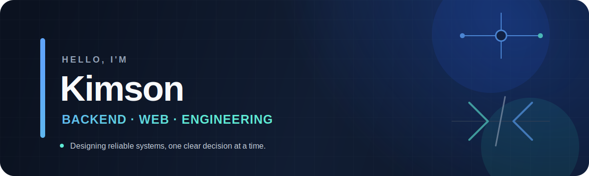
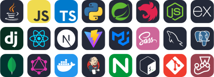
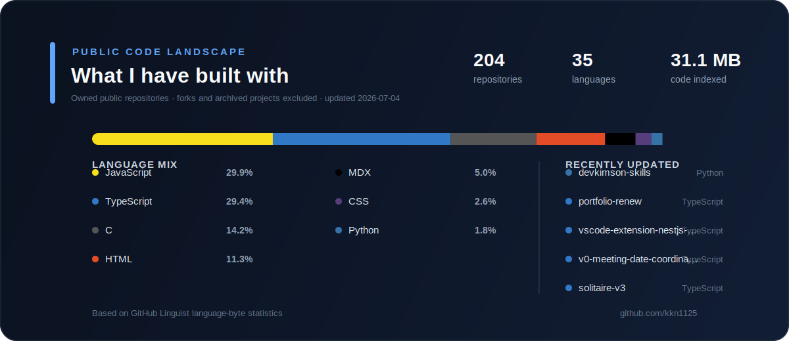

<div align="center">
  
</div>

<div align="center">

### 복잡한 문제를 단순한 구조로 풀어내는 웹 개발자

자기주도적으로 문제를 탐색하고, 서비스의 전체 흐름을 이해하며 개발합니다.<br />
백엔드를 중심으로 프론트엔드와 인프라까지 폭넓게 다룹니다.

[**Portfolio**](https://kkn1125.github.io/portfolio-renew) ·
[**Blog**](https://kkn1125.github.io) ·
[**GitHub**](https://github.com/kkn1125)

</div>

---

## About Me

```text
관심사      유지보수하기 좋은 설계, 안정적인 API, 개발 생산성
주력 분야   Backend, Web Application
개발 방식   작은 단위로 검증하고 명확한 근거를 남기는 개발
```

- 새로운 기술 자체보다 **왜 필요한지**, 서비스에 **어떤 가치를 주는지**를 먼저 고민합니다.
- 한 영역에 갇히지 않고 제품이 사용자에게 전달되는 전체 과정을 이해하려 합니다.
- 반복되는 문제를 자동화하고, 함께 일하기 좋은 코드와 문서를 만드는 것을 선호합니다.

## Featured Projects

| Project | Description | Links |
| :--- | :--- | :---: |
| **SnapPoll** | 빠르게 의견을 모으고 결과를 확인하는 투표 서비스 | [Repository](https://github.com/kkn1125/snappoll) |
| **Narang** | 사용자 간의 연결과 경험을 다루는 웹 프로젝트 | [Repository](https://github.com/kkn1125/narang) |
| **Mentee Union** | 멘티들의 협업과 성장을 위한 프로젝트 | [Repository](https://github.com/kkn1125/project-mentee-union) |
| **Typoz** | 타이핑 효과를 간편하게 구현하는 JavaScript 라이브러리 | [Repository](https://github.com/AnyRequest/typoz) · [Demo](https://anyrequest.github.io/typoz/) |

<details>
<summary><strong>More links</strong></summary>
<br />

| | Repository | Website |
| :--- | :--- | :--- |
| **Blog** | [kkn1125.github.io](https://github.com/kkn1125/kkn1125.github.io) | [Visit](https://kkn1125.github.io) |
| **Portfolio** | [portfolio-renew](https://github.com/kkn1125/portfolio-renew) | [Visit](https://kkn1125.github.io/portfolio-renew) |

</details>

## Tech Stack

<div align="center">
  
</div>

<details>
<summary><strong>Stack details</strong></summary>
<br />

| Area | Technologies |
| :--- | :--- |
| **Languages** | Java, JavaScript, TypeScript, Python |
| **Backend** | Spring Boot, NestJS, Node.js, Fastify, Express, Django |
| **Frontend** | React, Next.js, Vite, MUI, Sass |
| **Data** | MariaDB, MySQL, PostgreSQL, MongoDB, GraphQL |
| **Infrastructure** | Docker, Jenkins, Nginx, Bash, Git |
| **Web & Media** | Socket.IO, WebRTC, FFmpeg, JWT, NextAuth.js |
| **Testing** | Jest |

</details>

## Code Landscape

<div align="center">
  
</div>

## Contribution Graph

<div align="center">
  <picture>
    <source media="(prefers-color-scheme: dark)" srcset="https://raw.githubusercontent.com/kkn1125/kkn1125/output/github-contribution-grid-snake-dark.svg" />
    <source media="(prefers-color-scheme: light)" srcset="https://raw.githubusercontent.com/kkn1125/kkn1125/output/github-contribution-grid-snake.svg" />
    
  </picture>
</div>

---

<div align="center">
  <sub>Build thoughtfully. Learn continuously. Improve together.</sub>
</div>
